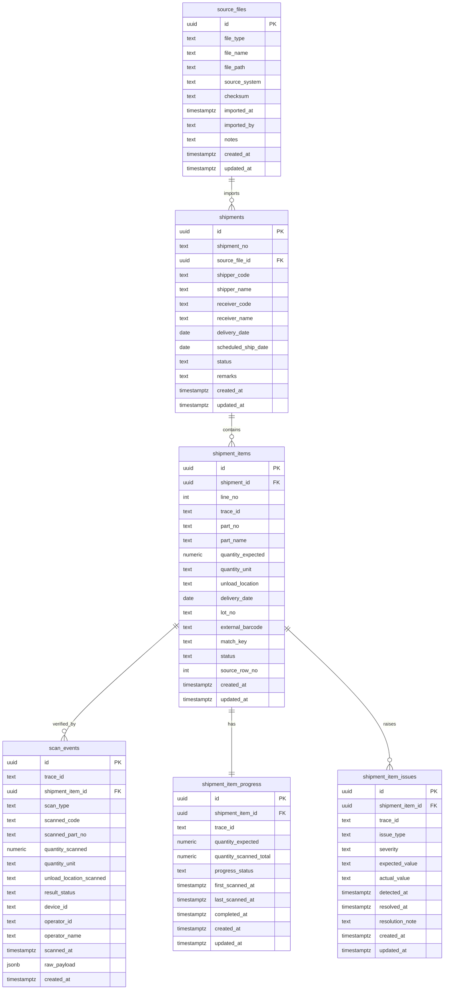

# db-schema.md
Logistics ERP / Logistics OS – Database Schema
Author: Shinya Kanda
Date: 2026-03-17

---

# 1. Purpose

This document defines the core database schema for the **logistics-erp** project.

The schema is designed for a staged system:

PDF
→ CSV
→ Importer
→ Expected Data
→ Actual Scan Events
→ Verification / Trace
→ Logistics ERP / Logistics OS

The database must support:

- environments without EDI
- expected vs actual verification
- traceability
- future WMS / ERP expansion

---

# 2. Design Principles

## Principle 1: Separate Expected and Actual

Expected data = what should be shipped  
Actual data = what was actually scanned / processed

These must remain separate.

## Principle 2: Preserve source traceability

All imported data should be traceable back to the original file.

## Principle 3: Keep core entities normalized

Do not mix source-file metadata, shipment headers, line items, and scan events into one table.

## Principle 4: Build for phased expansion

The initial schema should support later addition of:

- inventory
- billing
- warehouse operations
- full trace platform

---

# 3. Core Domain Model

The core schema is built around these entities:

- source_files
- shipments
- shipment_items
- scan_events
- shipment_item_progress
- shipment_item_issues
- trace_events (future)
- inventory_lots (future)

---

# 4. Phase 1 Schema (Expected Data)

## 4.1 source_files

Purpose:

Stores metadata about imported source files.

Typical examples:

- original PDF shipment instruction
- extracted CSV
- manually uploaded CSV

### Columns

- id (uuid, PK)
- file_type (text)  
  Example: pdf, csv
- file_name (text)
- file_path (text, nullable)
- source_system (text, nullable)  
  Example: manual_upload, pdf_extractor, future_shipper_wms
- checksum (text, nullable)
- imported_at (timestamptz)
- imported_by (text, nullable)
- notes (text, nullable)
- created_at (timestamptz)
- updated_at (timestamptz)

### Notes

This table is the root audit trail for imported data.

---

## 4.2 shipments

Purpose:

Stores shipment header information.

One shipment contains multiple shipment_items.

### Columns

- id (uuid, PK)
- shipment_no (text, nullable)
- source_file_id (uuid, FK → source_files.id)
- shipper_code (text, nullable)
- shipper_name (text, nullable)
- receiver_code (text, nullable)
- receiver_name (text, nullable)
- delivery_date (date, nullable)
- scheduled_ship_date (date, nullable)
- status (text)  
  Suggested values: draft, imported, in_progress, completed, issue_detected
- remarks (text, nullable)
- created_at (timestamptz)
- updated_at (timestamptz)

### Notes

This is the header-level shipment plan.

---

## 4.3 shipment_items

Purpose:

Stores shipment line items as Expected Data.

This is the most important planned-data table in the early phase.

### Columns

- id (uuid, PK)
- shipment_id (uuid, FK → shipments.id)
- line_no (integer, nullable)
- trace_id (text, unique in early phase if possible)
- part_no (text)
- part_name (text, nullable)
- quantity_expected (numeric)
- quantity_unit (text, nullable)  
  Example: pcs, case, pallet
- unload_location (text, nullable)
- delivery_date (date, nullable)
- lot_no (text, nullable)
- external_barcode (text, nullable)
- match_key (text, nullable)
- status (text)  
  Suggested values: planned, partially_scanned, matched, shortage, excess, wrong_part, wrong_location
- source_row_no (integer, nullable)
- created_at (timestamptz)
- updated_at (timestamptz)

### Notes

This table expresses what should happen.

trace_id is strategic and should remain stable across later scan and trace flows.

---

# 5. Phase 2 Schema (Actual Data)

## 5.1 scan_events

Purpose:

Stores atomic scanning / operational events from the field.

### Columns

- id (uuid, PK)
- trace_id (text, nullable)
- shipment_item_id (uuid, nullable, FK → shipment_items.id)
- scan_type (text)  
  Example: barcode_scan, qr_scan, manual_confirm
- scanned_code (text)
- scanned_part_no (text, nullable)
- quantity_scanned (numeric, nullable)
- quantity_unit (text, nullable)
- unload_location_scanned (text, nullable)
- result_status (text)  
  Suggested values: matched, shortage, excess, wrong_part, wrong_location, unknown
- device_id (text, nullable)
- operator_id (text, nullable)
- operator_name (text, nullable)
- scanned_at (timestamptz)
- raw_payload (jsonb, nullable)
- created_at (timestamptz)

### Notes

This table records what did happen.

It should preserve raw facts as much as possible.

---

## 5.2 shipment_item_progress

Purpose:

Stores the current verification/progress state of each shipment item.

### Columns

- id (uuid, PK)
- shipment_item_id (uuid, unique, FK → shipment_items.id)
- trace_id (text, nullable)
- quantity_expected (numeric)
- quantity_scanned_total (numeric, default 0)
- progress_status (text)  
  Suggested values: planned, in_progress, matched, shortage, excess, wrong_part, wrong_location
- first_scanned_at (timestamptz, nullable)
- last_scanned_at (timestamptz, nullable)
- completed_at (timestamptz, nullable)
- created_at (timestamptz)
- updated_at (timestamptz)

### Notes

This table is a current-state table derived from shipment_items + scan_events.

---

## 5.3 shipment_item_issues

Purpose:

Stores mismatches and problems detected during verification.

### Columns

- id (uuid, PK)
- shipment_item_id (uuid, FK → shipment_items.id)
- trace_id (text, nullable)
- issue_type (text)  
  Suggested values: shortage, excess, wrong_part, wrong_location, unreadable_code, unknown_item
- severity (text, nullable)  
  Suggested values: low, medium, high, critical
- expected_value (text, nullable)
- actual_value (text, nullable)
- detected_at (timestamptz)
- resolved_at (timestamptz, nullable)
- resolution_note (text, nullable)
- created_at (timestamptz)
- updated_at (timestamptz)

### Notes

This table keeps issue history instead of hiding mismatches inside status columns only.

---

# 6. Future Schema (Phase 3 and Later)

## 6.1 trace_events

Purpose:

Stores cross-process trace history.

Examples:

- planned
- picked
- loaded
- scanned_at_departure
- delivered
- received

### Proposed columns

- id (uuid, PK)
- trace_id (text)
- event_type (text)
- related_entity_type (text, nullable)
- related_entity_id (uuid, nullable)
- event_at (timestamptz)
- actor_id (text, nullable)
- actor_name (text, nullable)
- location_code (text, nullable)
- payload (jsonb, nullable)
- created_at (timestamptz)

---

## 6.2 inventory_lots

Purpose:

Future inventory / warehouse lot management.

### Proposed columns

- id (uuid, PK)
- trace_id (text, nullable)
- part_no (text)
- lot_no (text, nullable)
- quantity_on_hand (numeric)
- quantity_unit (text, nullable)
- warehouse_code (text, nullable)
- location_code (text, nullable)
- status (text, nullable)
- created_at (timestamptz)
- updated_at (timestamptz)

---

# 7. Relationship Overview

```text
source_files
  └─ shipments
       └─ shipment_items
            ├─ scan_events
            ├─ shipment_item_progress
            └─ shipment_item_issues

trace_id
  └─ connects shipment_items, scan_events, progress, issues, future trace_events
```

---

# 8. Mermaid ER Diagram



---

# 9. Suggested Indexes

## source_files

- index on imported_at
- index on file_type
- index on checksum

## shipments

- index on source_file_id
- index on shipment_no
- index on delivery_date
- index on status

## shipment_items

- index on shipment_id
- unique index on trace_id (if feasible in current phase)
- index on part_no
- index on unload_location
- index on delivery_date
- index on status
- index on match_key

## scan_events

- index on shipment_item_id
- index on trace_id
- index on scanned_code
- index on scanned_at
- index on result_status

## shipment_item_progress

- unique index on shipment_item_id
- index on trace_id
- index on progress_status

## shipment_item_issues

- index on shipment_item_id
- index on trace_id
- index on issue_type
- index on severity
- index on detected_at

---

# 10. Suggested Enum Candidates

These may begin as text columns and later be migrated to enums if stable.

## shipment status

- draft
- imported
- in_progress
- completed
- issue_detected

## shipment_item status / progress_status

- planned
- in_progress
- partially_scanned
- matched
- shortage
- excess
- wrong_part
- wrong_location

## issue_type

- shortage
- excess
- wrong_part
- wrong_location
- unreadable_code
- unknown_item

## scan_type

- barcode_scan
- qr_scan
- manual_confirm

---

# 11. Minimal Migration Order

Recommended implementation order:

## Step 1

Create:

- source_files
- shipments
- shipment_items

## Step 2

Update importer to insert expected shipment data

## Step 3

Create:

- scan_events
- shipment_item_progress
- shipment_item_issues

## Step 4

Create verification logic

## Step 5

Add future trace_events / inventory_lots as needed

---

# 12. Important Non-Goals for Early Phase

Do not add these too early:

- full billing schema
- full accounting schema
- complete warehouse slot master
- over-abstracted tenant model
- excessive normalization of optional master data

The early priority is:

**Shipment verification platform first.**

---

# 13. Recommended Next Step

Based on this schema, the next concrete implementation task should be:

1. create Supabase migrations for
   - source_files
   - shipments
   - shipment_items

2. update services/importer so that:
   - one import creates a source_files record
   - shipment header creates a shipments record
   - shipment rows create shipment_items records

3. then move to scan_events design and verification flow
